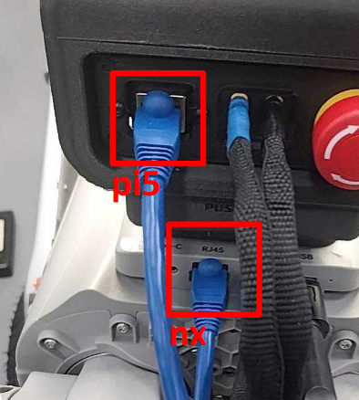

# Connect to the Dog

The rear of the dog has two visible Ethernet ports. The upper port connects to
the Pi 5, and the lower port connects to the Jetson Orin NX. This guide refers
to the Jetson Orin NX as `nx`.

<p align="center">
  
</p>

## Recommended Development Flow

1. Connect your PC directly to either the Pi 5 or `nx` with an Ethernet cable.
2. Configure your PC's Ethernet interface with a static IPv4 address on the
   `192.168.123.0/24` subnet:
   - IP address: `192.168.123.xxx`, where `xxx` is any unused value from `1` to `254`
   - Subnet mask: `255.255.255.0`
   - Gateway: `192.168.123.1`
3. SSH into the Pi 5 or `nx`:
   - Pi 5: `ssh nexuni@192.168.123.20`, password: `ingensys`
   - nx: `ssh unitree@192.168.123.18`, password: `123`
4. Connect both the Pi 5 and `nx` to the same local Wi-Fi network.

```bash
sudo systemctl restart NetworkManager

# List detected Wi-Fi networks.
sudo nmcli dev wifi list

# Connect to a Wi-Fi network.
sudo nmcli dev wifi connect "<wifi-ssid>" password "<wifi-password>"
```

5. Restore the direct Ethernet cable connection between the Pi 5 and `nx`.
6. Connect your PC to the same Wi-Fi network.

After these steps, your PC, `nx`, and the Pi 5 should all be on the same LAN.
You can then:

- SSH into either the Pi 5 or `nx` wirelessly.
- Open the security frontend in a browser at `https://<pi5-ip>`.
- Open the mapping frontend in a browser at `http://<nx-ip>:5089`.
