# nxmap Beginner User Manual

## 1. nxmap Overview

- Page 1: Mapping and point cloud cleanup. This is where you start/stop SLAM, save scan results, remove dynamic objects, and crop/denoise/downsample point clouds.

  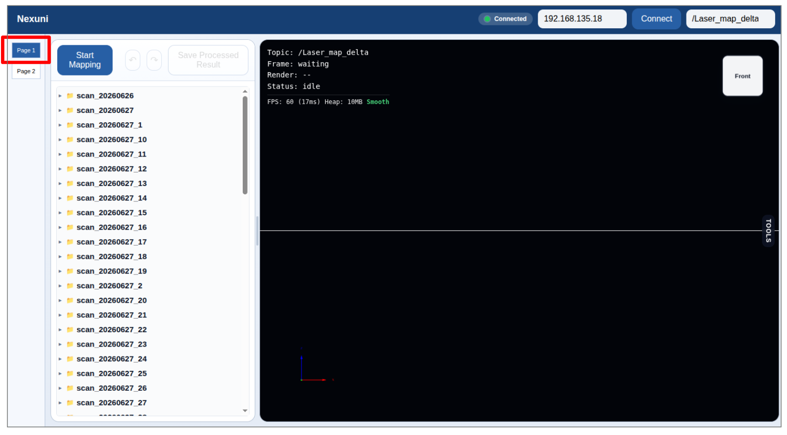

- Page 2: Navigation map editing. This is where you convert point clouds into 2D occupancy maps, edit black/white/gray areas, annotate zones, generate a PRM roadmap, and export map bundles.

  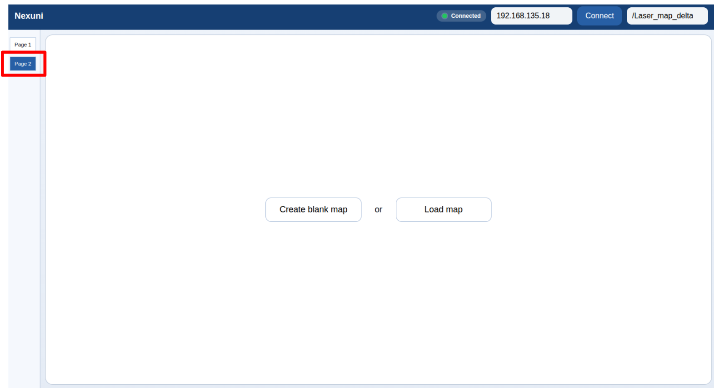

## 2. Meaning of 2D Map Colors

- Black: Obstacle, not traversable.
- White: Free space, traversable.
- Gray: Unknown area, which should not be used for navigation by default.

## 3. Recommended Beginner Workflow

1. Start mapping.

  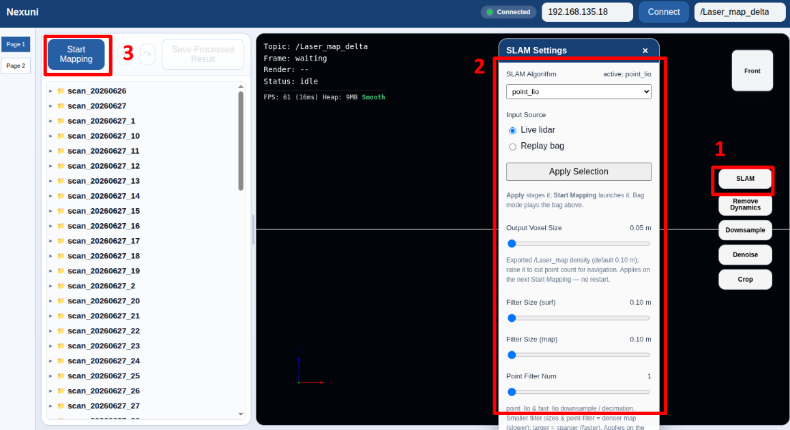

2. Stop mapping. 

  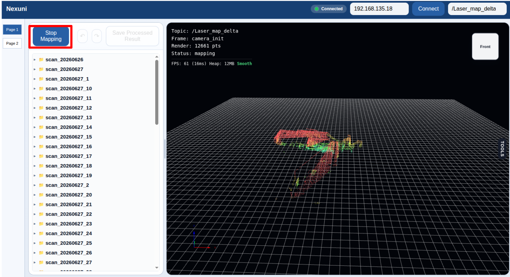

The result can be seen on left panel.

  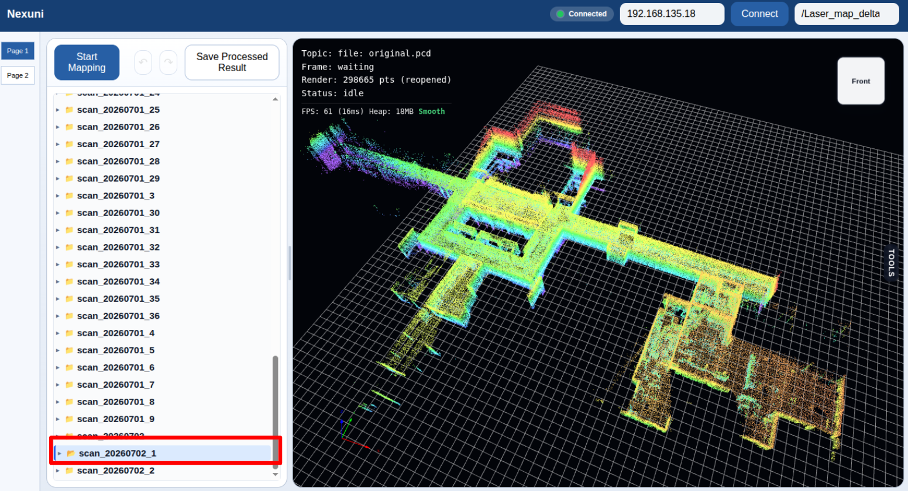

3. Create a Page 2 project from the processed PCD.

  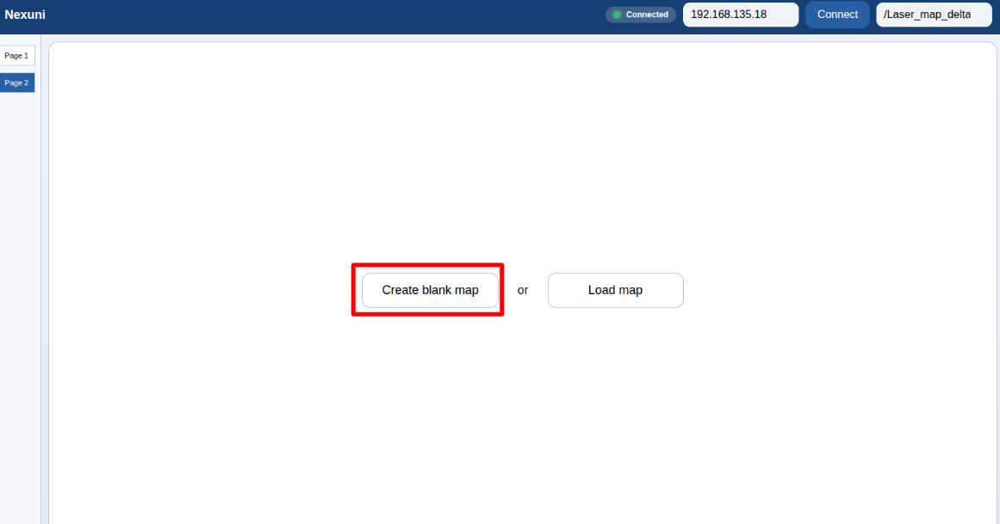

  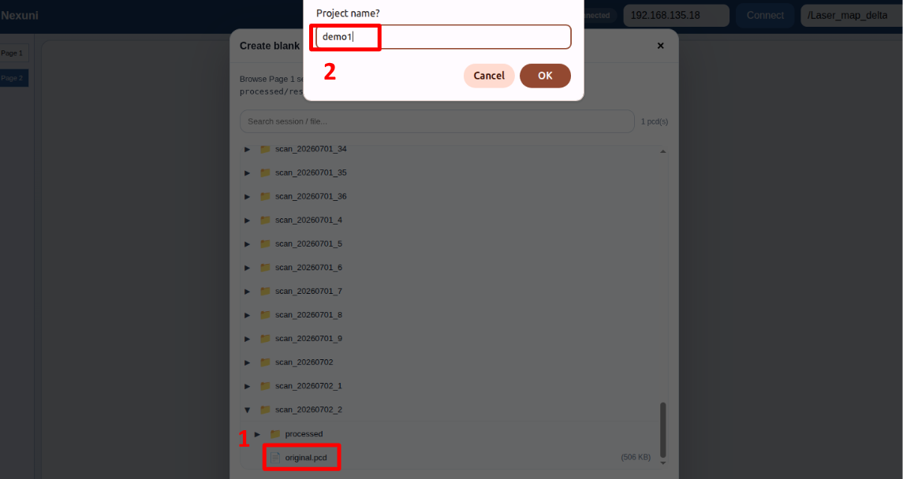

4. Translate and rotate the map if needed.

  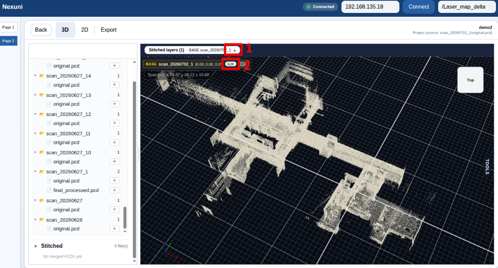

  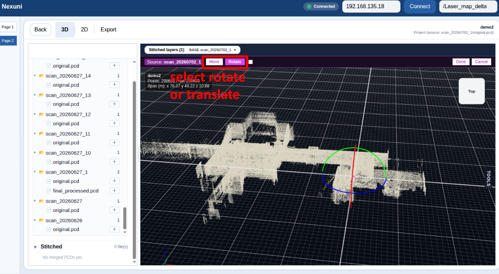

4. Generate a 2D map with Build Nav Map.

  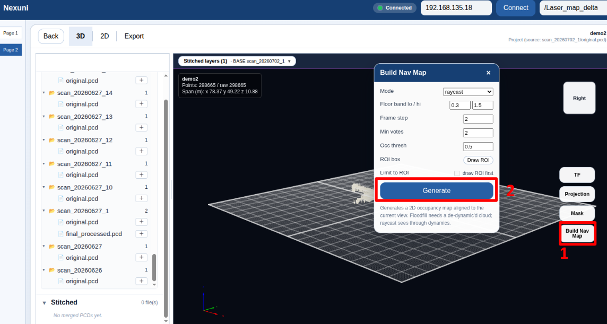

  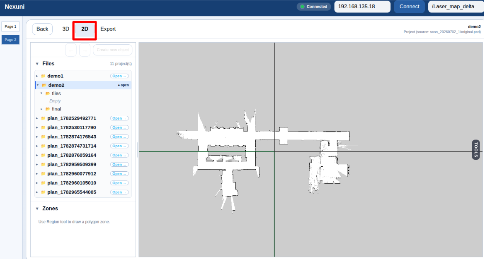

5. Manual cleanup the 2D map if needed.

  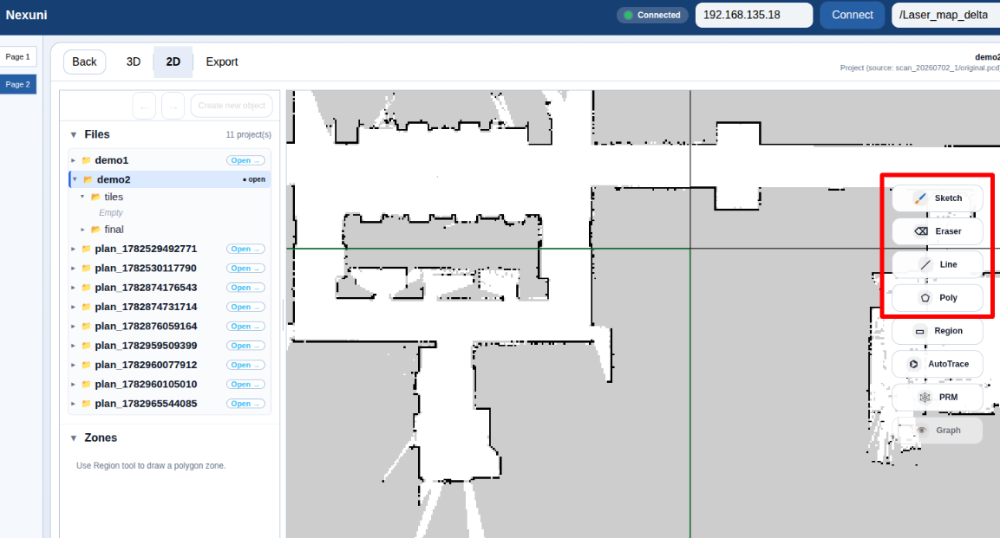

6. Generate the PRM graph.

  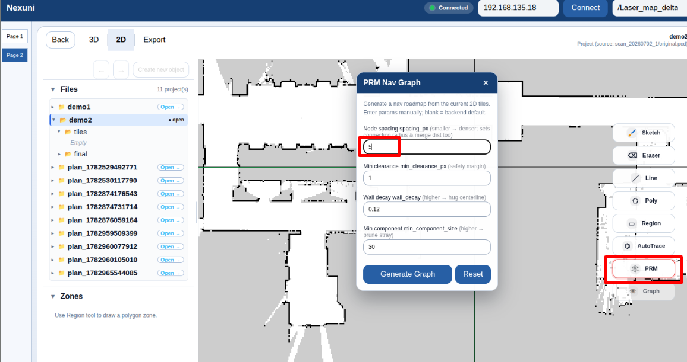

  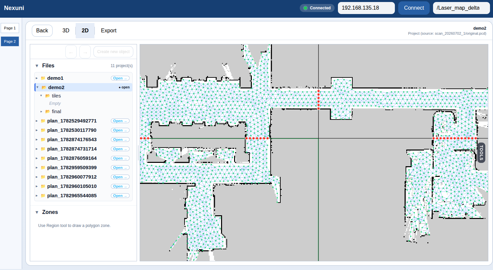

7. Export the map bundle as a `.zip` file. Note: the map name should not include hyphens (`-`). For example, `my-map` is not a valid name, but `mymap` is valid. The exported zip file can then be imported into the security frontend for navigation use. See the [security frontend user guide](../security-frontend/security-frontend-user-guide.md) for more details.

  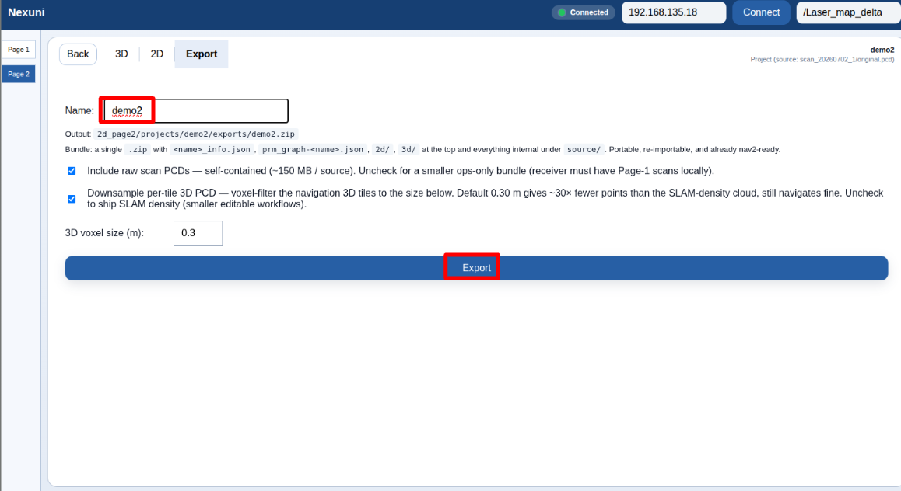

